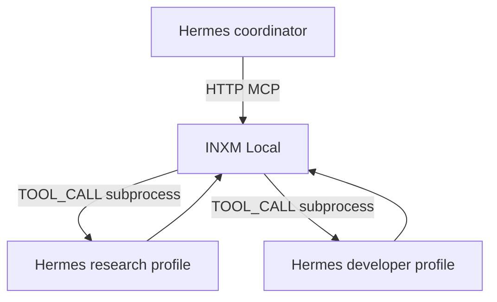

# Integrating Hermes Agent with INXM Local

This guide explains how to connect [Hermes Agent](https://github.com/NousResearch/hermes-agent) and INXM Local in both directions:

- **INXM Local → Hermes:** run a Hermes agent as a workflow step.
- **Hermes → INXM Local:** let Hermes compile, execute, inspect, repair, and schedule INXM plans over MCP.



## Prerequisites

Before configuring the integration:

1. Install and configure Hermes Agent.
2. Confirm that `hermes -z "Say hello"` works from a terminal.
3. Install and start INXM Local from the latest GitHub release.
4. Configure any compiler API key required by INXM Local.

On Windows, Hermes and INXM Local can both run natively. If INXM Local cannot find the `hermes` command, use the absolute path to the Hermes executable in the tool configuration.

## Run Hermes agents from INXM Local

INXM Local can invoke Hermes through an allowlisted subprocess tool. Each Hermes invocation is represented as a normal `TOOL_CALL` step.

Native `AGENT_CALL` plan steps are intentionally rejected by the current INXM runtime. A `PROMPT_CALL` is also different: it performs one tool-free model request rather than starting an autonomous Hermes agent.

### Why use `hermes -z`?

Hermes' `-z` mode is intended for scripted, one-shot use:

```sh
hermes -z "Research authentication options for this service"
```

It runs the normal Hermes agent and tools but writes only the final response to stdout. This makes it suitable for use as an INXM subprocess tool.

### Create one tool per Hermes profile

Using a separate Hermes profile for each role gives every workflow step a bounded purpose and an isolated tool configuration. For example, create `research` and `developer` Hermes profiles, then add the following entries to INXM Local's `tools.yaml`:

```yaml
tools:
  - name: hermes_researcher
    description: >
      Run the autonomous Hermes research profile for a bounded research task.
      Returns the agent's final response.
    config:
      kind: subprocess
      command: hermes
      args: ["-p", "research", "-z"]
    input_schema:
      type: object
      properties:
        prompt:
          type: string
          description: A complete, self-contained task for the agent
      required: [prompt]
    output_schema:
      type: object
    allowlisted: true
    timeout_secs: 900

  - name: hermes_developer
    description: >
      Run the autonomous Hermes developer profile for a bounded implementation
      or code-review task. Returns the agent's final response.
    config:
      kind: subprocess
      command: hermes
      args: ["-p", "developer", "-z"]
    input_schema:
      type: object
      properties:
        prompt:
          type: string
          description: A complete, self-contained task for the agent
      required: [prompt]
    output_schema:
      type: object
    allowlisted: true
    timeout_secs: 1800
```

You can also add these tools from **MCP Tools → Add subprocess tool** in INXM Local.

For a tool with one `prompt` input, INXM Local runs a command equivalent to:

```sh
hermes -p research -z "The resolved workflow prompt"
```

INXM Local passes subprocess inputs in two ways:

- Positionally, after the fixed `config.args` values.
- As `INXM_ARGS` and individual `INXM_ARG_<NAME>` environment variables.

### Use the tools in a plan

A plan can pass the result of one Hermes agent to another:

```yaml
inputs:
  - name: topic
    description: Subject to research
    value_type: string
    required: true

  - name: root_directory
    description: Repository or working directory for implementation
    value_type: string
    required: true

steps:
  - id: research
    name: Research the implementation
    config:
      type: TOOL_CALL
      tool: hermes_researcher
      arguments:
        prompt: >
          Research approaches for ${input.topic}. Return constraints,
          tradeoffs, and a recommended implementation.
    outputs:
      - name: findings
        value_type: string

  - id: implement
    name: Implement the recommendation
    depends_on: [research]
    config:
      type: TOOL_CALL
      tool: hermes_developer
      arguments:
        prompt: >
          Implement the following recommendation in ${input.root_directory}.

          Research:
          ${step.research.findings}

          Run relevant tests and summarize the changed files.
    outputs:
      - name: result
        value_type: string
```

When a tool returns plain text and the step declares exactly one output, INXM Local assigns that text to the declared output. The next step can therefore reference `${step.research.findings}`.

### Use a wrapper for structured agent options

The direct subprocess configuration works best when the tool has one dynamic input: `prompt`. If a workflow needs to select the profile, model, skills, working directory, or other options at runtime, use a small wrapper program instead.

The wrapper should:

1. Read the JSON object in `INXM_ARGS`.
2. Validate the requested profile and options against an allowlist.
3. Build and run the corresponding Hermes command.
4. Return structured JSON on stdout.

For example:

```json
{
  "response": "The agent's final response",
  "profile": "research",
  "completed": true
}
```

Structured output gives later workflow steps named fields instead of one opaque text value. Do not pass unrestricted user input directly into shell command strings.

## Trigger INXM Local from Hermes

INXM Local starts a local HTTP MCP server with the desktop application. The default endpoint is:

```text
http://127.0.0.1:39387/mcp
```

A health endpoint is available at:

```text
http://127.0.0.1:39387/health
```

The port can be changed under **Settings → Local MCP server** in INXM Local.

### Add INXM Local to Hermes

With INXM Local running, add its MCP endpoint to Hermes:

```sh
hermes mcp add inxm-local --url http://127.0.0.1:39387/mcp
hermes mcp test inxm-local
```

Alternatively, add it directly to `~/.hermes/config.yaml`:

```yaml
mcp_servers:
  inxm-local:
    url: "http://127.0.0.1:39387/mcp"
    tools:
      include:
        - compile_plan
        - list_plans
        - show_plan
        - edit_plan
        - execute_plan
        - list_runs
        - inspect_run
        - repair_run
        - list_patches
        - schedule_plan
        - list_schedules
```

Restart Hermes after changing its configuration, or run `/reload-mcp` in an active Hermes session.

Hermes prefixes MCP tool names with the configured server name. Depending on name normalization, tools appear with names similar to:

```text
mcp_inxm_local_list_plans
mcp_inxm_local_execute_plan
mcp_inxm_local_inspect_run
```

Normally you do not need to reference those generated names directly. Describe the task and tell Hermes to use INXM Local.

### Ask Hermes to execute an existing plan

Example prompt:

```text
Use INXM Local to list the available plans. Show deploy-staging, then execute
it with environment set to staging. Inspect the resulting run and report any
failures.
```

Hermes can call `list_plans`, `show_plan`, `execute_plan`, and `inspect_run` as needed.

### Ask Hermes to compile a plan

Example prompt:

```text
Use INXM Local to compile a reusable workflow that researches a topic with the
Hermes researcher tool and then passes the findings to the Hermes developer
tool. Make the topic and repository root invocation inputs.
```

The resulting plan is validated and saved by INXM Local before it can be executed.

### Handle human-interaction steps

If an INXM plan reaches a `HUMAN_INTERACTION` step, `execute_plan` returns a structured response with:

- `status: "elicitation_required"`
- The persisted `run_id`
- The step ID and prompt
- The expected response schema

After obtaining a response, Hermes can resume the same run by calling `execute_plan` again:

```json
{
  "plan_ref": "deploy-staging",
  "run_id": "run-id-from-the-first-response",
  "human_responses": {
    "approve-deployment": true
  }
}
```

The executor resumes from its persisted checkpoint. Completed dependencies are not repeated.

## Hermes MCP server mode is different

The command:

```sh
hermes mcp serve
```

starts Hermes as a stdio MCP server, but it does not expose a generic "run an agent" tool. It primarily exposes Hermes messaging and conversation capabilities such as listing conversations, reading messages, and sending messages through connected platforms.

Use the appropriate integration for each purpose:

| Goal | Integration |
|---|---|
| Run an autonomous Hermes agent as an INXM step | INXM subprocess tool calling `hermes -z` |
| Let Hermes compile or execute INXM workflows | INXM HTTP MCP endpoint |
| Let INXM access Hermes messaging channels | Hermes `mcp serve` stdio server |
| Perform one model request with no tools | INXM `PROMPT_CALL` step |

## Prevent recursive workflows

A circular integration is possible:

1. INXM Local invokes a Hermes worker.
2. That worker has the INXM MCP server enabled.
3. The worker invokes another INXM plan.
4. The new plan invokes another Hermes worker.

Avoid accidental recursion by separating coordinator and worker profiles:

- A **coordinator profile** may include the `inxm-local` MCP connection.
- Profiles invoked by INXM, such as **research** and **developer**, should not include that MCP connection unless recursion is explicitly required and bounded.

Also use:

- Explicit task descriptions for each worker tool.
- Conservative step and tool timeouts.
- Hermes iteration limits.
- INXM retry limits.
- Human approval before destructive actions.
- Separate credentials and tool allowlists for each profile.

A Hermes call remains an autonomous, non-deterministic operation inside an otherwise deterministic INXM plan. Treat it as an opaque external tool boundary: validate its inputs, constrain its permissions, persist its output, and let INXM control dependencies, retries, scheduling, and approvals around it.

## Networking and lifecycle limitations

The current INXM MCP server:

- Starts with the desktop application.
- Listens only on `127.0.0.1`.
- Does not expose authentication because it is loopback-only.

This works directly when Hermes and INXM Local run natively on the same machine. If Hermes runs in WSL, Docker, a virtual machine, or on another host, its `127.0.0.1` is not the Windows host running INXM Local. Use a carefully secured local proxy or tunnel, or add a dedicated headless/server deployment mode before exposing the endpoint beyond the local machine.

Do not expose the unauthenticated MCP endpoint directly to a LAN or the public internet.

## Troubleshooting

### INXM cannot find `hermes`

- Confirm `hermes -z "test"` works in a new terminal.
- Restart INXM Local after installing Hermes or changing `PATH`.
- Configure the absolute Hermes executable path in the subprocess tool.
- On Windows, confirm the executable or command shim is available through `PATHEXT`.

### The Hermes step times out

- Increase `timeout_secs` for the catalog tool or step.
- Reduce the Hermes profile's maximum iterations.
- Make the prompt bounded and self-contained.
- Ensure Hermes is not waiting for an interactive approval. Scripted workers should use a profile whose approval behavior is appropriate for unattended execution.

### Hermes cannot connect to INXM Local

- Confirm the desktop app is running.
- Open `http://127.0.0.1:39387/health`.
- Check **Settings → Local MCP server** for the configured port or a bind error.
- Run `hermes mcp test inxm-local`.
- Restart or reload Hermes after changing its MCP configuration.
- If Hermes runs in WSL or a container, account for the separate loopback network.

### Hermes does not see the INXM tools

- Check that the MCP server is enabled in `~/.hermes/config.yaml`.
- Check the `tools.include` filter.
- Run `/reload-mcp` or restart Hermes.
- Run `hermes mcp test inxm-local` and inspect the reported connection error.
